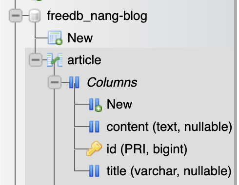

# Kotlin, Spring Boot, MySQL, JPA, Hibernate Rest API

Built a Restful CRUD API using Kotlin, Spring Boot, AWS RDS/EC2, Docker, JPA, Buildkite, MockMVC, JUnit5 and Hibernate.

Requires a remotely hosted mysql DB. Currently hosted on https://freedb.tech/dashboard/index.php. 
MySql Admin: https://phpmyadmin.freedb.tech/
    - Server: sql.freedb.tech:3306/freedb_nang-blog

Hosted on render https://nang-blog.onrender.com via jar file running in docker container. 
To run locally, build the jar with maven and run the jar.

DB Schema is as follows:

